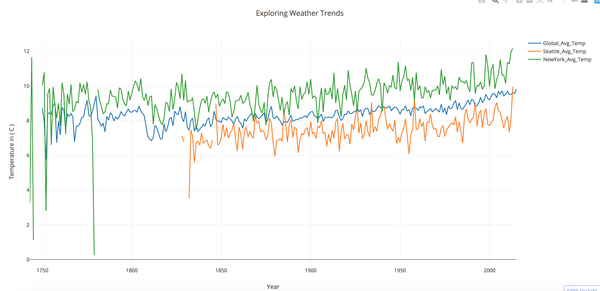
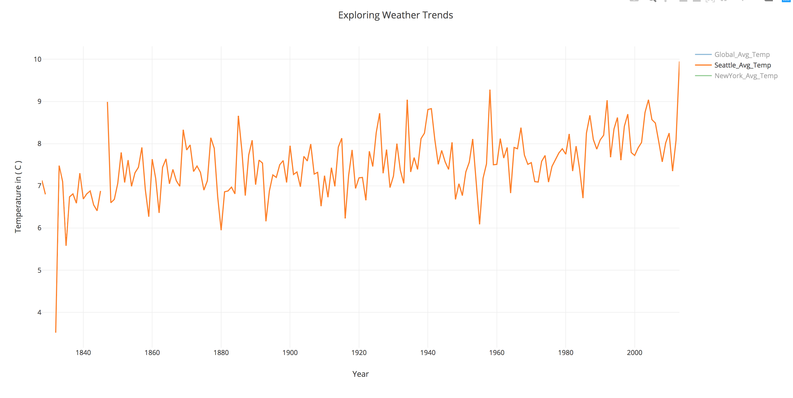
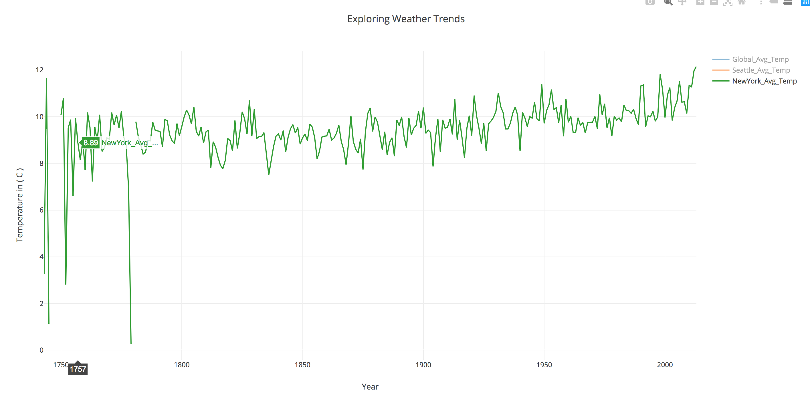
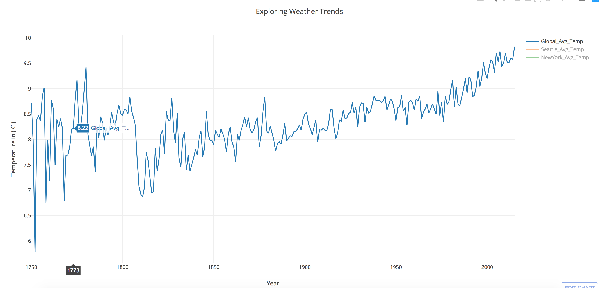
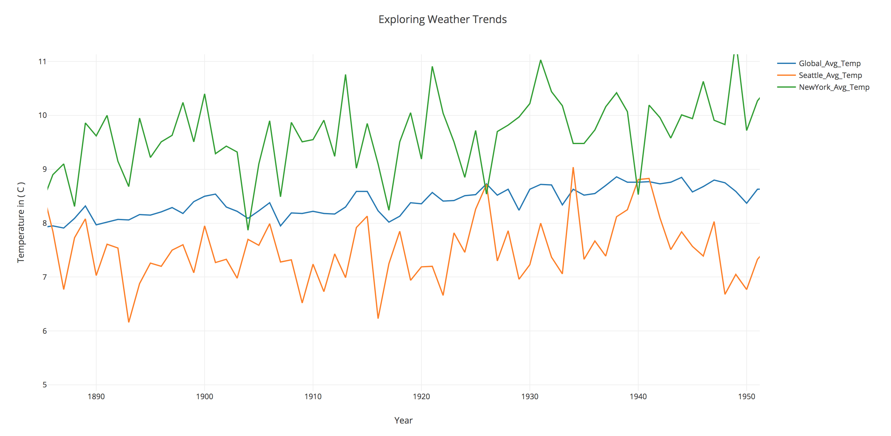
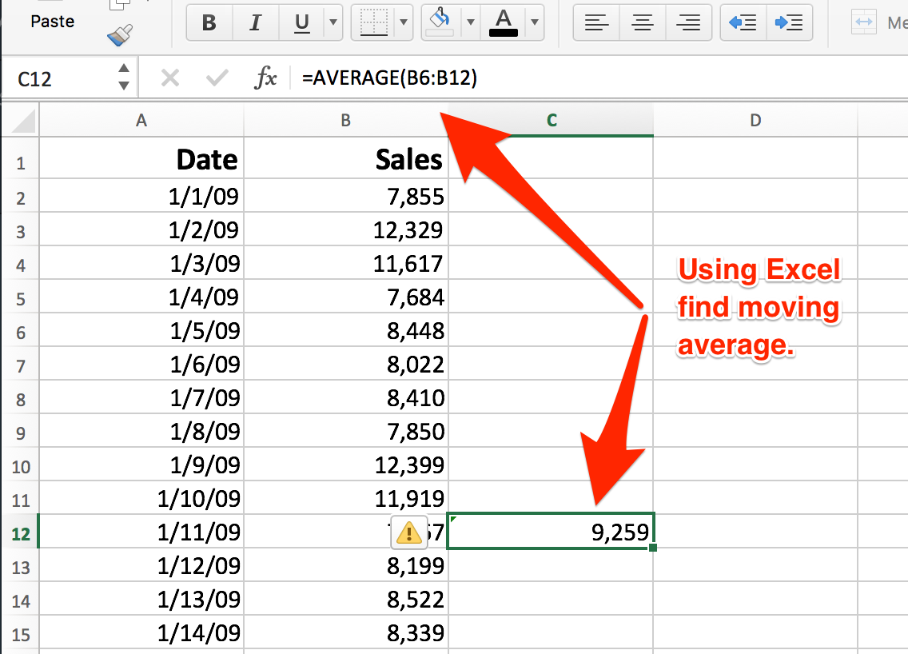

# Explore Weather Trends #
By: Ardian Ajvazi
Udacity: Project 1 February 2019


## Goal
Create a visualization and prepare a write up describing the similarities
and differences between global temperature trends and temperature trends
in the closest big cities where I live or want to live.


## Outline
Use Udacity's built in program to extract data using SQL
```
// STEP 1 find city near me in the United States.
    SELECT *
    	FROM city_list
        WHERE country LIKE 'United States'

//STEP 2 look the global_data
    SELECT * FROM global_data

/* STEP 3 Selected the tables I needed  and
   assigned unique names to identify easier.*/

      SELECT
        city_data.city AS city,
        city_data.avg_temp AS City_Avg_Temp,
        city_data.year
      FROM city_data
        WHERE city LIKE 'Seattle'
        	 OR city LIKE 'New York'


// STEP 4 Download .csv file from Udacity.

```

<br />
<br />
<br />
Use different libraries to create line-charts of our data.
```
import plotly.plotly as py # using to draw our graph online
import plotly.graph_objs as go
import plotly.figure_factory as FF
import numpy as np
import pandas as pd

// Read our .csv file and assign data to variable. Results by city and global.
dataCities = pd.read_csv('city_results.csv')
dataGlobal = pd.read_csv('Global_results.csv')

//Selecting data of specific city
Seattle = dataCities[(dataCities.city=='Seattle')]
NewYork = dataCities[(dataCities.city=='New York')]
Global = dataGlobal

// Passing data to x and y axis.
  trace1 = go.Scatter(
      x=Global['year'],
      y=Global['global_avg_temp'],
      mode='lines',
      name='Global_Avg_Temp'
  )
  trace2 = go.Scatter(
      x=Seattle['year'],
      y=Seattle['city_avg_temp'],
      mode='lines',
      name='Seattle_Avg_Temp'
  )
  trace3 = go.Scatter(
      x=NewYork['year'],
      y=NewYork['city_avg_temp'],
      mode='lines',
      name='NewYork_Avg_Temp'
  )

// Layout to add names to axis.
layout = go.Layout(
    title='Exploring Weather Trends',
        xaxis=dict(
            title='Year'
        ),
        yaxis=dict(
            title='Temperature in ( C )'
        )
    )

fig = go.Figure(data=[trace1, trace2, trace3], layout=layout)

py.plot(fig, filename='Exploring Weather Trends')

```
<br />
# Link to view Line-Chart online.

Link: (https://plot.ly/~ardianajvazi/14/exploring-weather-trends/#/)

# Photos.
Combined cities and global


Seattle

<br />
<br />
New York

<br />
<br />
<br />

Global

<br />
<br />
Zoomed in year


# Moving Average in Excel


# Observation

 1. New York's average_temp was above the global average majority of the time.
 2. Seattle's average_temp was below the global average majority of the time.
 3. The results seem pretty constant at this. Small rise in global temperature.
 4. The rises that we see could be a result of new industries but hard to say.


# Resources  
- Used Plotly to handle line-charts: (https://plot.ly/python/line-charts/)
- Link to GitHub: (https://github.com/ardianajvazi/Udacity_Exploring_Weather_Trends)
